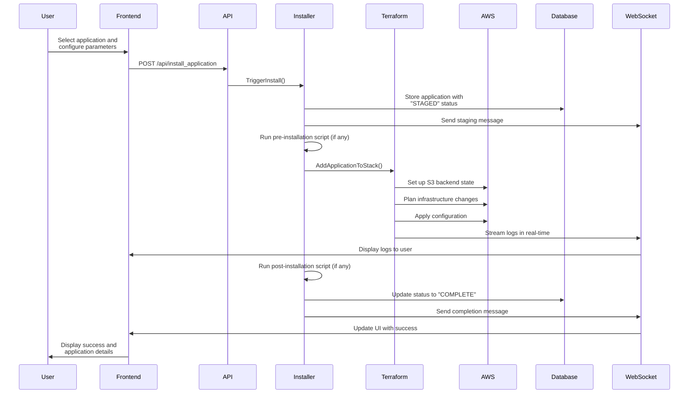
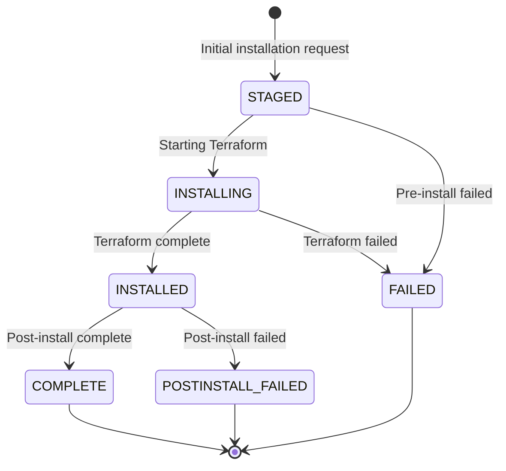

# CLAUDE.md - Unity Management Console

## Overview
The Unity Management Console is a web application that serves as the core management portal for the Unity SDS (Science Data System) environment. It provides an interface for configuring Unity environments and installing/managing Unity software components.

### Purpose
- Configures and customizes AWS environments for running Unity software
- Manages the deployment of applications from a marketplace
- Provides real-time feedback on installation progress
- Centralizes management of Unity SDS components

### Architecture
- **Frontend**: Svelte/TypeScript single-page application
  - Component-based UI with Tailwind CSS
  - Real-time updates via WebSockets
  - Marketplace browsing and application configuration

- **Backend**: Go REST API and WebSocket server
  - AWS infrastructure management
  - Terraform-based deployment orchestration
  - Application lifecycle management
  - WebSocket communication for real-time updates

### Key Features
- Application marketplace with installation wizard
- AWS infrastructure bootstrapping
- Real-time installation progress monitoring
- Configuration management via SSM parameters
- WebSocket-based communication for live updates

## Application Installation Process

The installation workflow combines a user-friendly frontend wizard with backend deployment automation using Terraform. Here's the detailed process:

### Installation Workflow Diagram

### Application States

### Code Components Involved

#### Frontend Components
- **Installation Wizard UI**: 
  - `/src/routes/install/+page.svelte` - Main installation page
  - `/src/components/SetupWizard.svelte` - Installation wizard component
  - `/src/routes/install/advanced_var.svelte` - Advanced variable configuration

- **HTTP/WebSocket Communication**:
  - `/src/data/httpHandler.ts` - API communication layer
  - `/src/data/websocketStore.ts` - WebSocket connection management
  - `/src/store/websocketstore.ts` - WebSocket state management

- **Progress Display**:
  - `/src/components/ProgressFeedback.svelte` - Installation progress UI
  - `/src/components/SocketTerminal.svelte` - Terminal output component
  - `/src/routes/progress/+page.svelte` - Progress page

#### Backend Components
- **API Layer**:
  - `/backend/internal/web/api.go` - REST API endpoints
  - `/backend/internal/web/router.go` - Route definitions
  - `/backend/internal/websocket/websocketmanager.go` - WebSocket handling

- **Installation Engine**:
  - `/backend/internal/processes/installer.go` - Main installation orchestration
  - `/backend/internal/processes/marketplace.go` - Marketplace application handling

- **Terraform Integration**:
  - `/backend/internal/terraform/management.go` - Terraform configuration generation
  - `/backend/internal/terraform/runner.go` - Terraform execution
  - `/terraform/modules/unity-cloud-env/main.tf` - Base Terraform configuration

- **Database Operations**:
  - `/backend/internal/database/operations.go` - Database CRUD operations
  - `/backend/internal/database/models/models.go` - Database models

### Installation Steps in Detail

1. **User Selection and Configuration**
   - User selects application from marketplace
   - Enters deployment name and configures parameters
   - Reviews installation summary

2. **Installation Request**
   - Frontend sends installation request to backend API
   - Backend validates request and creates database entry

3. **Pre-Installation**
   - Installer checks for pre-installation scripts
   - Runs any required setup steps before Terraform

4. **Terraform Deployment**
   - Creates Terraform configuration based on application template
   - Sets up backend state in S3
   - Executes Terraform plan and apply
   - Streams logs in real-time through WebSockets

5. **Post-Installation**
   - Runs any post-installation scripts
   - Updates application status
   - Sends completion notification

6. **Monitoring and Feedback**
   - Real-time progress updates via WebSockets
   - Terminal-like interface shows detailed logs
   - Status indicators show current installation phase

## Commands
- Build backend: `make build` or `go build -buildvcs=false -o ./main ./backend/cmd/web`
- Build frontend: `npm run build`
- Build all: `npm run build-all`
- Dev server: `npm run dev`
- Serve locally: `npm run serve`
- Run all tests: `go test -p 1 -v ./...`
- Run single test: `go test -v -run=TestName ./path/to/package`
- Lint Go: `make fmtcheck && make importscheck && make staticcheck`
- Lint frontend: `npm run lint`
- Format frontend: `npm run format`

## Style Guidelines
- Go: Follow standard Go formatting with `gofmt`
- Imports: Standard lib → external → internal packages
- Frontend: TypeScript + Svelte with ESLint/Prettier
- Error handling: Always check errors and provide context
- Naming: CamelCase for Go, camelCase for JS/TS variables
- Tests: Follow *_test.go pattern with descriptive test names
- Frontend styling: Use Tailwind CSS classes

## Development Workflow
1. Start frontend dev server: `npm run dev`
2. Build full application: `npm run build-all`
3. Run locally with backend: `npm run serve`
4. AWS credentials must be set via environment variables for backend functionality